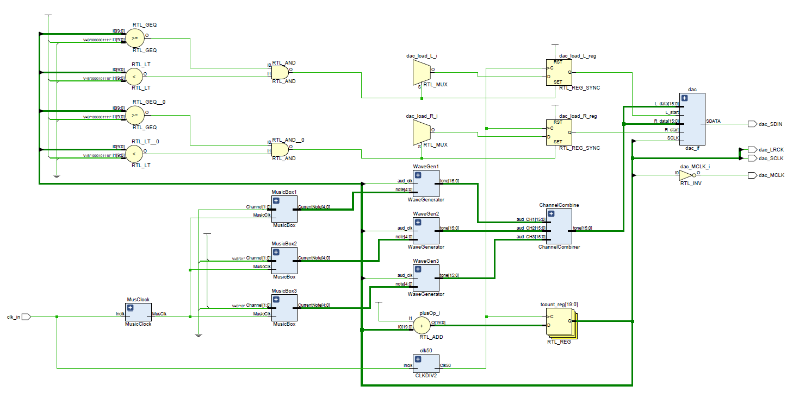

# CPE 487 Tetris Final Project

* Our project was to create a working Tetris video game with music that runs entirely and natively on the provided FPGA, the Nexys A7-100T.
* The project is designed to be stored and run natively on the Nexys A7-100T and requires the following external parts:
  * A VGA Monitor and cable to display the game from the VGA output on the FPGA.
  * A Pmod I2S DAC and speaker to output the game music.
      * This isn't required for the game to work, but there won't be any music without it.

## Game Logic

## Display Logic

### CPE 487 Display Logic Overview
* In pursuit of optimal graphics design, a primary objective was to minimize memory usage, prompted by initial challenges encountered when attempting to store 1280x720x3 in block RAM. Additionally, our aim was to demonstrate proficiency in leveraging both raster and vector graphics.

### gpu.vhd
* The principal file within the graphics module, 'gpu.vhd,' serves to partition the screen into distinct div/containers, allowing for differential treatment and the application of various outputs from different modules.

### vga_sync.vhd
* The 'vga_sync.vhd' file is responsible for generating synchronization signals for the VGA. Adapted from lab 3, it has been updated to accommodate a resolution of 1280x720.

### clk_wiz_0.vhd and clk_wiz_0_clk_wiz.vhd
* These files are instrumental in generating a pixel clock from the built-in 100MHz clock specifically for the VGA.

### word_handle.vhd
* By dividing the container into six smaller containers and normalizing the x and y coordinates, 'word_handle.vhd' sets the stage for utilization in 'letter_handle.vhd.'

### letter_handle.vhd
* Within 'letter_handle.vhd' resides a lookup table encompassing all characters employed in the project. It produces color outputs based on the given x and y coordinates.

### inttoword.vhd
* Serving as a component interface, 'inttoword.vhd' streamlines the process of displaying numbers by taking integer inputs and generating word outputs for 'word_handle.'

### Grid
* This module divides the container into 32x32 squares, ask for color information, and conveys data, including color, x, and y coordinates, to 'square.vhd.'

### square.vhd
* 'Square.vhd' encapsulates the equations essential for drawing squares with shadows, contributing to the overall graphics presentation.

## Music Logic
* The code required to generate and output the tetris theme comes from the following modules. A brief description is included below each:
   * TetrisMusic.vhd
      * This is a modified version of the lab 5 code which retains the code necessary to get the dac output working.
   * dac.vhd
      * This is the same module taken from the *dac_if* module of lab 5, this is also required to get the dac output working.
   * Square_Wave_Generator.vhd
      * A variable clock divider that generates specific square wave frequencies that become the audio signal that eventually gets output by the DAC. 
   * MusicBox.vhd
      * This module iterates through one of three 128-entry long note lists, and outputs a 5-bit vector depending on the note stored.
   * ChannelCombiner.vhd
      * This module takes the outputs of the three audio signals sent to it by the three square wave generator entities and combined their audio signals into a single 16-bit signed to be sent to the DAC. 
   * ClkDiv2.vhd
      * This divides the 100MHz system clock we use to 50MHz to be used as an input clock for the code taken from lab 5 because that code was written with a 50MHz system clock in mind.
   * MusicClock.vhd
      * This divides the 100MHz system clock down to be a 18.666Hz clock, which powers the MusicBox's logic.

### Modifications and created code for Music Logic
* Modifications
  * I modified the top-level module from lab 5 *siren.vhd* to create the top-level module *TetrisMusic.vhd*, which retained the same timing logic and logic necessary to get the DAC working, but has all of the code and logic I used to generate the music and signals that are then combined to be input into the dac code in a similar way that the wail instance sent it's data into the DAC.
  * I also kept the *dac_if* module that was in lab 5 and simplified the name to just be *dac* since it also was necessary to get the DAC to operate properly.

 * Created code
    * I created two different clock dividers which were necessary to ensure the DAC operated as intended and also another clock divider that sends its clock into the *MusicBox* to give it the proper timing signals to work as intended and at the correct speed.
       * The *ClkDiv2.vhd* module divides the system clock of 100MHz by 2 to be a 50MHz clock, this is necessary because the code I took from lab 5 that powers the DAC requires a 50MHz clock, but our project uses the 100MHz clock and I couldn't implement an additional 50MHz clock without Vivado getting angry at me.
       * The *MusicClock* module divides the system clock of 100MHz by 5357144 to create a 18.666Hz clock that I use in the *MusicBox.vhd* module to generate the proper timings for the music. I figured out we needed an 18.666Hz clock for the music because the tempo of the music is 140BPM and it allows for a fixed note length of 107ms which I use to time the length of the notes and breaks in each channel of audio.
         
    * I then created a new module, *Square_Wave_Generator.vhd* that inputs the 48.8KHz audio sampling rate the DAC uses and also will take in a 5-bit logic vector that is used to select the current note that will be generated. The code also outputs a 16-bit signed value which represents the audio signal of the output.
       * The first part of the code compares the 5-bit input to a 32-entry lookup table that relates each bit combination to a specific note, so for example the bit combination "01000" will relate to the note A5, which has a value of 55.
       * Each of these notes has a calculated value that gets used in the next step, a clock divider, which divides the input 48.8KHz clock by the value found from the table, so in the case of A5, we divide the 48800Hz clock by 55 and get a signal with the frequency of 887Hz, which is as close as we can get to A5's actual value of 880Hz.
       * After we get a new, temporary clock with the desired clock frequency, a function outputs a 16-bit signed with either the value of 10240 or -10240, depending on whether the new clock signal is low or high respectively.
       * Additionally, in my code there is also a note that represents no-note, or no audio for that period, this is when the 5-bit input is "00000" and for that case, no clock division is performed and instead the 16-bit signed output will have a value of 0 for the entire period.
   
    * To feed the "Square_Wave_Generator.vhd" with notes to play, I created a "MusicBox.vhd" module, which inputs the MusicClock of 18.666Hz, a 2-bit vector which determines which of the three tracks to play, and an output 5-bit vector that gets sent directly into the *Square_Wave_Generator.vhd" module above.
       * The architecture of this module has two parts, a counter that counts at the 18.666Hz clock speed and counts over the range of 0 to 127, and a set of three 128-long tables, each table contains the note sequence for each channel and a note value for each value of the counter.
          * The counter is clocked at the 18.666Hz that is provided to it from the "MusicClock.vhd" module and counts from 0 to 127, once it reaches 127 it'll start over at 0 again.
          * Depending on the input channel, we have three different tables that will be interated downards with the counter, each coresponding to a channel of audio and will result in polyphony once the three channels are combined. So for the first instance of MusicBox, it'll be initialized with a constant Channel value of "00", so it'll iterate down the first list of notes and change it's current note output every clock of the counter. The second channel will be with "01" and that results in a different note list being used and a new note being sent to a *SquareWaveGenerator* instance, same thing for the third channel.
          * Each table ranges from 0 to 127, just like the counter, and the output will be a 5-bit value sent to *SquareWaveGenerator* that coresponds to the note that should be generated, such as "01000" being A5.
          * Each note and non-note has a fixed length of 107ms using this approach, and will change every clock pulse of MusicClock when the counter is incremented by 1.

   * After all three instances of *Square_Wave_Generator.vhd* generates an audio signal, each of their audio signals is sent into *ChannelCombiner.vhd*, where it takes three inputs, each being a 16-bit signed generated from each instance of SquareWaveGenerator, and then it outputs a single 16-bit signed that represents the combined signal of all three channels.
      * The process to combine the three signals is very simple, I simply made an intermediate integer variable called *combined*, which I then set equal to the TO_INTEGER of all three input audio channels added together.
      * From there, I had another temporary value, *result* which was equal to the TO_SIGNED(combined, 16), which just converted the integer value calculated above, back into a signed so the types would match, this value was then assigned to the output.
      * I didn't have to worry about any logic to avoid clipping because of my implementation of SquareWaveGenerator, which I chose the signed values of being 10240 and -10240 because I knew that I would be using three channels and that in the event that all three channels were 10240 and were added together, the highest/lowest value that would be output by the channel combiner would be 30720 and -30720, which fits within the 16-bit signed range of (32768,-32768) naturally.

### Block Diagram and Video

https://github.com/csirikak/CPE-487-Final/assets/90861355/0e17b16b-fe72-4b88-b302-b8643e4d9bb4

